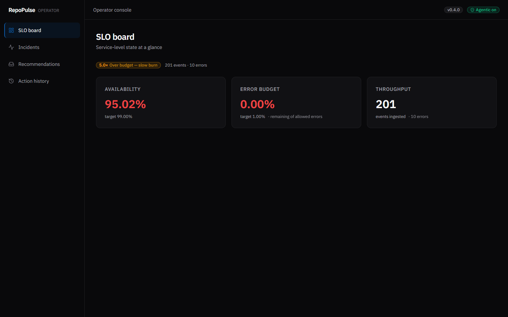
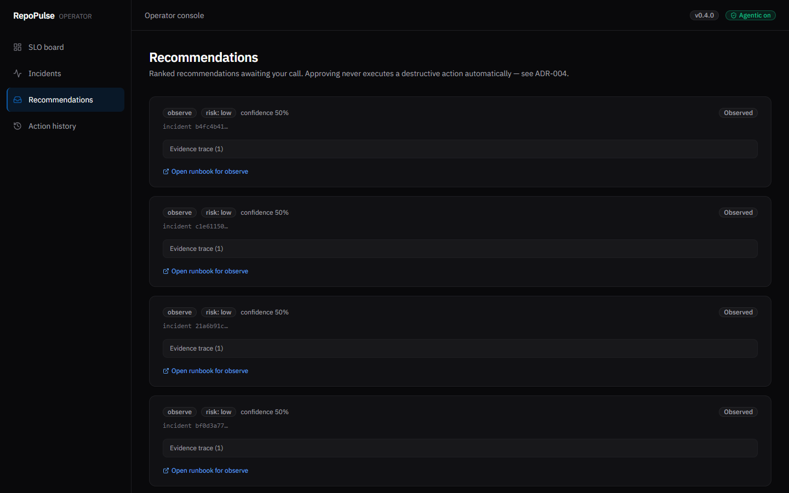
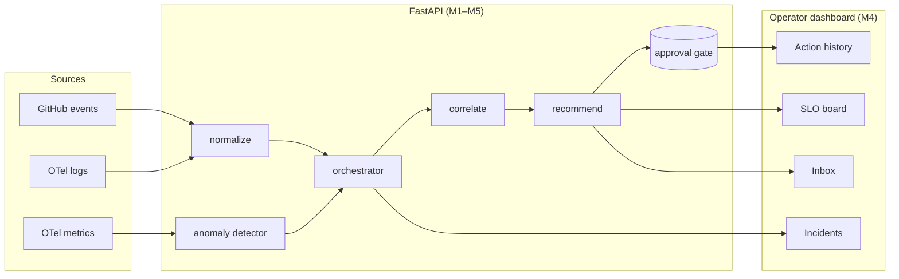

# OpsGraph — RepoPulse AIOps

[](#status)
[](#)
[](#)
[](#)
[](docs/results-report.md)
[](LICENSE)

> **Production-grade AIOps reference.** Ingest events from GitHub, OTel logs,
> and OTel metrics → detect anomalies → group correlated signals into
> incidents → emit ranked recommendations with explainable evidence → human
> approval gate → automated workflows with safety guardrails. Operator
> dashboard included.

## Demo

```bash
export REPOPULSE_API_SHARED_SECRET="$(openssl rand -hex 16)"
export REPOPULSE_AGENTIC_SHARED_SECRET="$(openssl rand -hex 16)"
./scripts/demo.sh
```

→ Dashboard at http://127.0.0.1:3000 · API at http://127.0.0.1:8000 (loopback only).

| | |
|---|---|
|  |  |
| **SLO board** — availability, error budget, throughput, burn-rate badge | **Recommendations inbox** — ranked recommendations with approval gate + per-category runbook links |

See [docs/demo/README.md](docs/demo/README.md) for the full walkthrough.

## What it does

| Layer | Module | Tech | TDD'd? |
|---|---|---|---|
| Ingest | `repopulse.api.events` | FastAPI | ✅ |
| Detect | `repopulse.anomaly.detector` | Modified z-score (Iglewicz & Hoaglin, 1993) | ✅ |
| Correlate | `repopulse.correlation.engine` | Time-window grouping | ✅ |
| Recommend | `repopulse.recommend.engine` | Rule-based + evidence trace | ✅ |
| Action gate | `repopulse.api.recommendations` | Pending → approved/rejected state machine ([ADR-004](adr/ADR-004-approval-gate-model.md)) | ✅ |
| Agentic actions | `.github/workflows/agentic-*.yml` | Kill-switch + scoped tokens ([ADR-003](adr/ADR-003-agentic-execution-model.md)) | ✅ |
| Operator UI | `frontend/` | Next.js 15 + Tailwind 4 + Base UI toast | ✅ |

## Results

KPIs from `backend/scripts/benchmark.py` running 4 reproducible scenarios:

| KPI | Value |
|---|---|
| Scenarios run | 4 |
| **False-positive rate** | **0%** |
| **MTTR** (avg, anomaly→trigger) | **5.0 s** |
| MTTR (max) | 10.0 s |
| Burn-rate lead time (avg) | 0.0 s |

Source: [`docs/superpowers/plans/m6-evidence/benchmark.json`](docs/superpowers/plans/m6-evidence/benchmark.json)
· Methodology + per-scenario detail: [`docs/results-report.md`](docs/results-report.md)
· Re-run command:
```bash
cd backend && ./.venv/Scripts/python -m repopulse.scripts.benchmark \
  --scenarios-dir ../scenarios \
  --out ../docs/superpowers/plans/m6-evidence/benchmark.json
```

## Architecture



Per-milestone diagrams: [`docs/architecture.md`](docs/architecture.md) · M3 deep-dive: [`docs/aiops-core.md`](docs/aiops-core.md).

## Engineering standards

- **TDD across both languages** — run `cd backend && pytest --co -q` and
  `cd frontend && npm test` for current counts (see CI for green status).
- **Strict typing** — mypy strict, TypeScript strict.
- **Anti-hallucination** — every claim in every milestone handoff has a
  re-runnable command + captured artifact under
  [`docs/superpowers/plans/m<n>-evidence/`](docs/superpowers/plans/).
- **WCAG 2.2 AA dashboard** — live-DOM contrast probe, keyboard verification,
  semantic HTML before ARIA. See [`docs/ui-design-system.md`](docs/ui-design-system.md).
- **Code review per milestone** — `superpowers:code-reviewer` subagent
  reports filed under each milestone's evidence dir.

## Status

| Milestone | Tag | Topic |
|---|---|---|
| M1 | `v0.1.0-m1` | Foundation, OTel, `/healthz` |
| M2 | `v0.2.0-m2` | SLO module, ingest, load generator |
| M3 | `v0.3.0-m3` | AIOps core (detect + correlate + recommend) |
| M5 | `v0.4.0-m5` | GitHub agentic workflows (read-only, kill-switch) |
| M4 | `v0.5.0-m4` | Operator dashboard UI |
| **M6** | **`v1.0.0`** | **Benchmark + portfolio polish** |
| **v1.1** | **`v1.1.0`** | **Pipeline API auth, CORS, ingest hardening** |

## Setup + contributing

- [`docs/SETUP.md`](docs/SETUP.md) — prerequisites + WSL/Docker walkthrough
- [`docs/CONTRIBUTING.md`](docs/CONTRIBUTING.md) — workflow + TDD rule
- [`docs/TROUBLESHOOTING.md`](docs/TROUBLESHOOTING.md) — common gotchas

## Author

Made by **Ibrahim Samad** ([@Ibrahim4594](https://github.com/Ibrahim4594)).
Licensed under [MIT](LICENSE).

> **Naming note.** Repository is `OpsGraph-A`; the runtime package + internal
> branding is `RepoPulse`. The two will converge in a follow-up rename.
