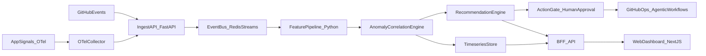

# OpsGraph

> **AIOps reference project: ingest, detect, correlate, recommend — with explainable evidence and human-in-the-loop guardrails.**

[](#status)
[-blue)](docs/superpowers/plans/milestone-3-handoff.md)
[](backend/pyproject.toml)
[](backend/tests)
[](backend/pyproject.toml)
[](backend/pyproject.toml)
[](#license)

> 🚧 **This project is still being developed.** Backend foundation, observability, and the AIOps core (M1–M3) are complete and tagged. GitHub agentic workflows (M5), the operator dashboard (M4 — final UI milestone), and portfolio polish (M6) are next. See the [roadmap](#roadmap) for the full sequence.

---

## What is OpsGraph?

OpsGraph is a production-grade AIOps reference architecture: it ingests heterogeneous operational events (GitHub activity, OpenTelemetry signals, application logs), detects time-series anomalies, correlates related signals into incidents, and emits **explainable recommendations** — each with an action category, a confidence score, an evidence trace, and a risk level. Destructive actions are gated behind explicit human approval; agentic workflows operate inside scoped permissions; every claim the system makes is traceable back to its source events.

**Design principles**

- **Evidence over guesses.** Every recommendation carries the rules that fired and the underlying events that triggered them. No black-box outputs.
- **Human-in-the-loop by default.** Read-only triage is automatic; anything destructive requires explicit approval through an action gate.
- **Observability before intelligence.** SLOs, error budgets, and burn-rate alerts are first-class — built before the AI logic depends on them.
- **Backend-first, UI last.** The AIOps core ships and is verifiable via API + tests + telemetry well before any dashboard work begins.

---

## Architecture



Full component map and trust-boundary discussion in [`docs/architecture.md`](docs/architecture.md). Algorithm choices documented in [`adr/ADR-002-aiops-core-algorithms.md`](adr/ADR-002-aiops-core-algorithms.md).

---

## Status

| Order | Milestone | Scope | Status | Tag |
|---|---|---|---|---|
| 1 | **M1** | Backend foundation (FastAPI, settings, `/healthz`, CI, base docs) | ✅ Complete | [`v0.1.0-m1`](https://github.com/Ibrahim4594/OpsGraph-A/releases/tag/v0.1.0-m1) |
| 2 | **M2** | Observability + SLO baseline (OTel, RED metrics, burn-rate, runbook) | ✅ Complete | [`v0.2.0-m2`](https://github.com/Ibrahim4594/OpsGraph-A/releases/tag/v0.2.0-m2) |
| 3 | **M3** | AIOps core (normalize, anomaly detection, correlation, recommendation) | ✅ Complete | [`v0.3.0-m3`](https://github.com/Ibrahim4594/OpsGraph-A/releases/tag/v0.3.0-m3) |
| 4 | **M5** | GitHub agentic workflows + scoped action gate | ⏳ Planned | — |
| 5 | **M4** | Operator dashboard (UI; deferred to end of build per the UI Hold Gate) | ⏳ Planned | — |
| 6 | **M6** | Portfolio polish (KPI report, demo flow, contributor docs) | ⏳ Planned | — |

Detailed roadmap with goals, KPIs, and acceptance criteria: [`docs/roadmap.md`](docs/roadmap.md).

---

## Features Delivered (through M3)

- **HTTP ingest** — `POST /api/v1/events` accepts a canonical envelope, validates with pydantic, and forwards to the in-memory pipeline.
- **Event normalization** — pure-functional, source-aware kind taxonomy, deterministic severity inference, span-friendly flat attribute schema.
- **Anomaly detection** — modified z-score (Iglewicz & Hoaglin, 1993) with optional seasonal-baseline sampling for diurnal/weekly cycles. Robust to outliers in the baseline window.
- **Correlation** — time-window proximity grouping over a unified anomaly+event timeline; multi-source incidents are first-class.
- **Recommendations** — rule-based engine with four prioritized rules (`observe` → `triage` → `escalate` → `rollback`), explicit `evidence_trace`, deterministic confidence and risk levels.
- **Recommendations API** — `GET /api/v1/recommendations?limit=10` returns the latest ranked output.
- **Telemetry** — full OpenTelemetry traces + RED metrics on every endpoint, with proper resource attributes (`service.name`, `service.version`, `deployment.environment`). Validated via [`docs/runbooks/telemetry-validation.md`](docs/runbooks/telemetry-validation.md).
- **SLO module** — pure-functional availability / latency / error-budget / burn-rate computations following the Google SRE workbook multi-window strategy. Spec at [`docs/slo-spec.md`](docs/slo-spec.md).
- **Synthetic load generator** — deterministic load-driving for reproducible burn-rate evidence.
- **Bounded in-memory orchestrator** — content-signature dedup so repeated ingests don't generate duplicate recommendations. Interface is intentionally Redis-Streams-shaped for the eventual swap.
- **Deterministic CI** — lint + strict typecheck + tests on every push and PR. 115 tests, sub-second runtime.

---

## Tech Stack

| Layer | Tooling |
|---|---|
| **Language** | Python 3.11+ (tested on 3.14) |
| **Web framework** | FastAPI + Uvicorn |
| **Settings** | `pydantic-settings` (env-prefixed `REPOPULSE_`) |
| **Telemetry** | OpenTelemetry SDK 1.41 + auto-instrumentation for FastAPI |
| **Testing** | pytest 9, httpx test client, `opentelemetry-test-utils` |
| **Lint** | ruff (E, F, I, B, UP, N rule sets) |
| **Typecheck** | mypy strict (no implicit `Any`, no missing returns, all functions annotated) |
| **CI** | GitHub Actions on `ubuntu-latest`, Python 3.11 |
| **Local infra** | Docker Compose (OTel Collector contrib, optional) |
| **Frontend (deferred)** | Next.js 15 + Tailwind v4 + shadcn/ui (UI Hold Gate active until M5 ships) |

---

## Quickstart

```bash
# 1. Clone
git clone https://github.com/Ibrahim4594/OpsGraph-A.git
cd OpsGraph-A

# 2. Backend bring-up
cd backend
python -m venv .venv && source .venv/bin/activate     # Windows: .venv\Scripts\activate
pip install -e ".[dev]"

# 3. Run the API
uvicorn repopulse.main:app --reload --port 8000

# 4. In another shell — try it
curl http://localhost:8000/healthz
# => {"status":"ok","service":"RepoPulse","environment":"development","version":"0.3.0"}

curl -X POST http://localhost:8000/api/v1/events \
  -H "Content-Type: application/json" \
  -d '{
    "event_id": "00000000-0000-0000-0000-000000000001",
    "source": "github",
    "kind": "push",
    "payload": {"commit": 1}
  }'
# => 202 Accepted

curl http://localhost:8000/api/v1/recommendations
# => {"recommendations":[{"action_category":"observe", ...}],"count":1}
```

For the full multi-source rollback demo (with anomalies driven in-process), run [`docs/superpowers/plans/m3-evidence/run-pipeline.py`](docs/superpowers/plans/m3-evidence/run-pipeline.py) inside the venv.

---

## Quality Gates

```bash
cd backend
ruff check src tests        # lint
mypy                        # strict typecheck
pytest -v                   # 115 tests, sub-second
pip install -e .            # build
```

CI runs all four on every push and PR; configuration lives in [`.github/workflows/ci.yml`](.github/workflows/ci.yml).

---

## Repository Layout

| Path | Purpose |
|---|---|
| [`backend/`](backend/) | FastAPI service + AIOps core (Python ≥3.11) |
| [`backend/src/repopulse/`](backend/src/repopulse/) | Source: `pipeline/`, `anomaly/`, `correlation/`, `recommend/`, `api/`, `telemetry.py`, `slo.py`, `config.py` |
| [`backend/tests/`](backend/tests/) | 115 tests across 13 files; pure unit + HTTP integration + end-to-end pipeline |
| [`infra/`](infra/) | OpenTelemetry Collector config + Docker Compose |
| [`docs/`](docs/) | Architecture, AIOps core spec, SLO spec, security model, runbooks |
| [`adr/`](adr/) | Architecture Decision Records (ADR-001 hybrid architecture, ADR-002 AIOps algorithms) |
| [`plans/`](plans/) | High-level project plan + per-milestone execution plans |
| [`docs/superpowers/plans/`](docs/superpowers/plans/) | Per-milestone handoff reports with skills-invocation logs and evidence artefacts |
| [`.github/workflows/`](.github/workflows/) | Deterministic CI |

---

## Documentation

| Doc | Why read it |
|---|---|
| [`docs/architecture.md`](docs/architecture.md) | High-level component map, trust boundaries, build order |
| [`docs/aiops-core.md`](docs/aiops-core.md) | M3 deep-dive: normalize, detect, correlate, recommend |
| [`docs/slo-spec.md`](docs/slo-spec.md) | SLI/SLO definitions, error-budget math, burn-rate alert thresholds |
| [`docs/security-model.md`](docs/security-model.md) | Threat model, action-gate principles, secret handling, GitHub workflow boundaries |
| [`docs/runbooks/telemetry-validation.md`](docs/runbooks/telemetry-validation.md) | How to prove the telemetry path end-to-end |
| [`adr/ADR-001-hybrid-architecture.md`](adr/ADR-001-hybrid-architecture.md) | Why backend + frontend split, why backend-first delivery |
| [`adr/ADR-002-aiops-core-algorithms.md`](adr/ADR-002-aiops-core-algorithms.md) | Detector / correlation / recommendation algorithm choices and alternatives |
| [`plans/aiops-detailed-implementation-plan.md`](plans/aiops-detailed-implementation-plan.md) | The non-negotiable plan that drives every milestone |
| [`docs/superpowers/plans/milestone-1-handoff.md`](docs/superpowers/plans/milestone-1-handoff.md) → [M2](docs/superpowers/plans/milestone-2-handoff.md) → [M3](docs/superpowers/plans/milestone-3-handoff.md) | Per-milestone evidence logs and "what's next" prompts |

---

## Engineering Standards

This repository follows strict, evidence-first engineering process:

- **Test-driven development** for every behavior change. Each commit pair shows a failing red test before the implementing green commit.
- **Anti-hallucination protocol** — no claim is allowed in any handoff doc without a re-runnable command and a captured artifact.
- **Code review** between milestones. M3 caught two critical wiring/state issues that the test suite missed; both now have regression tests.
- **Architecture Decision Records** for anything non-trivial — including a documented "what was rejected and why" section.
- **UI Hold Gate** — substantial dashboard work waits for explicit user confirmation, even though the design system is selected and parked.

The discipline is documented per-milestone in the handoff reports under [`docs/superpowers/plans/`](docs/superpowers/plans/).

---

## Roadmap

Active execution order is **backend-first, UI last** — the AIOps core ships and is provable via API and telemetry well before any dashboard work begins. This deliberately differs from the parent plan's nominal milestone numbering and is documented in [`adr/ADR-001-hybrid-architecture.md`](adr/ADR-001-hybrid-architecture.md).

```
M1 ──► M2 ──► M3 ──► M5 ──► M4 (UI) ──► M6
 ✅     ✅     ✅     ⏳        ⏳         ⏳
```

| KPI | Target | Tracked in |
|---|---|---|
| MTTR (simulated incidents) | ≥ 30 % reduction | M6 portfolio report |
| False-positive alerts | ≥ 25 % reduction | M3 anomaly detector tests + M6 |
| SLO burn-rate detection lead time | ≥ 20 % improvement | M2 SLO module + M6 |
| Incident scenario reproducibility | ≥ 90 % | M3 + M6 |
| Core module test coverage | ≥ 80 % | every milestone CI |

---

## Author

**Made by Ibrahim Samad** ([@Ibrahim4594](https://github.com/Ibrahim4594)) — software engineer focused on observability, reliability, and AI-augmented operations. OpsGraph is a long-running portfolio project demonstrating production-grade AIOps with explicit guardrails and operator-friendly evidence trails.

Open to questions, issues, and contributions — please file them on the [issue tracker](https://github.com/Ibrahim4594/OpsGraph-A/issues).

---

## License

MIT (license file lands in M6 portfolio polish; until then, all rights are reserved by Ibrahim Samad and the project is shared for review and educational reference).

---

> **Note on naming.** The GitHub repository is `OpsGraph-A`. Internal code namespaces still use the original codename `RepoPulse` (Python package `repopulse`, env-prefix `REPOPULSE_`, OTel `service.name=repopulse-backend`). A clean rename is planned as a follow-on commit before M6.
