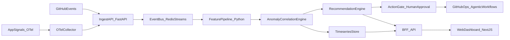

# Architecture

## High-Level Diagram

## Component Map

| Component | Responsibility |
|---|---|
| **GitHubEvents** | Webhook ingress for GitHub repo activity (pushes, PRs, issues, workflow runs). External, untrusted source. |
| **AppSignals_OTel** | Application-emitted OpenTelemetry spans, metrics, and logs (traces/metrics/log correlation). |
| **OTelCollector** | OpenTelemetry Collector that fans signals into the ingest path with batching and basic enrichment. |
| **IngestAPI_FastAPI** | The FastAPI service. Authenticates inbound payloads, normalizes them into a canonical event schema, and writes to the event bus. Rate-limits and validates. |
| **EventBus_RedisStreams** | Redis Streams as the durable, replayable event bus between ingest and feature pipeline. |
| **FeaturePipeline_Python** | Python workers that consume raw events and emit features (windowed counts, rate signals, change-point candidates). |
| **AnomalyCorrelationEngine** | Robust baseline + seasonality-aware anomaly detection. Correlates related signals into incident timelines. |
| **TimeseriesStore** | Persists features and anomaly scores so the dashboard and recommendation engine can replay history. |
| **RecommendationEngine** | Consumes anomaly groups, emits ranked recommendations with action category, confidence, evidence trace, and risk level. |
| **ActionGate_HumanApproval** | Gates destructive recommendations behind explicit operator approval. Read-only by default. |
| **GitHubOps_AgenticWorkflows** | Executes approved recommendations via GitHub agentic workflows (issue triage, CI failure analysis, doc drift). Scoped tokens. |
| **BFF_API** | Backend-for-frontend route handlers serving the dashboard. Composes recommendations + timeseries for operator views. |
| **WebDashboard_NextJS** | Operator dashboard. **Deferred to the final UI milestone** — no implementation in M1-M5. |

## Trust Boundaries

1. **External → IngestAPI** — strongest boundary. GitHubEvents and OTel collector input is treated as untrusted: payloads validated against canonical schemas, secrets verified, malformed events rejected.
2. **IngestAPI → EventBus** — internal trust, but events are still schema-validated on the way in to prevent garbage propagation.
3. **AnomalyEngine → RecommendationEngine** — internal; recommendations carry evidence traces so the action gate can audit causes.
4. **RecommendationEngine → ActionGate (Human Approval)** — explicit human-in-the-loop boundary for any destructive action category. Read-only recommendations bypass.
5. **ActionGate → GitHubOps** — egress boundary. Tokens are scoped to the minimum permissions per action category. Force-pushes and merges to `main` are blocked.

## Build Order (Backend-First)

The backend pipeline (left-to-middle of the diagram) is built first across M1-M5:

- **M1** — IngestAPI FastAPI scaffold + `/healthz` (this milestone).
- **M2** — OTel collector wiring; SLI/SLO baseline; synthetic telemetry generator.
- **M3** — FeaturePipeline + AnomalyCorrelationEngine + RecommendationEngine.
- **M5** — ActionGate + GitHubOps agentic workflows.

The right side (BFF_API + WebDashboard) lands in the final UI milestone (M4 in the parent plan; sequenced last in execution per `plans/milestone-1-execution-plan.md`). Dashboard design system is parked at `.claude/skills/design-system/SKILL.md`.
