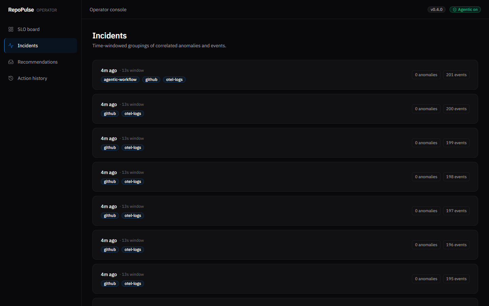
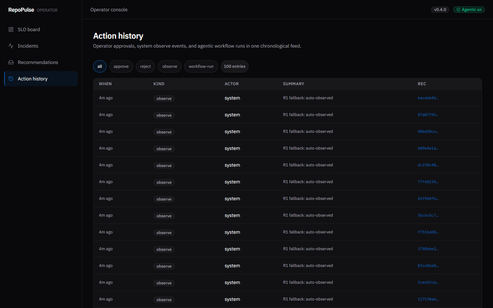
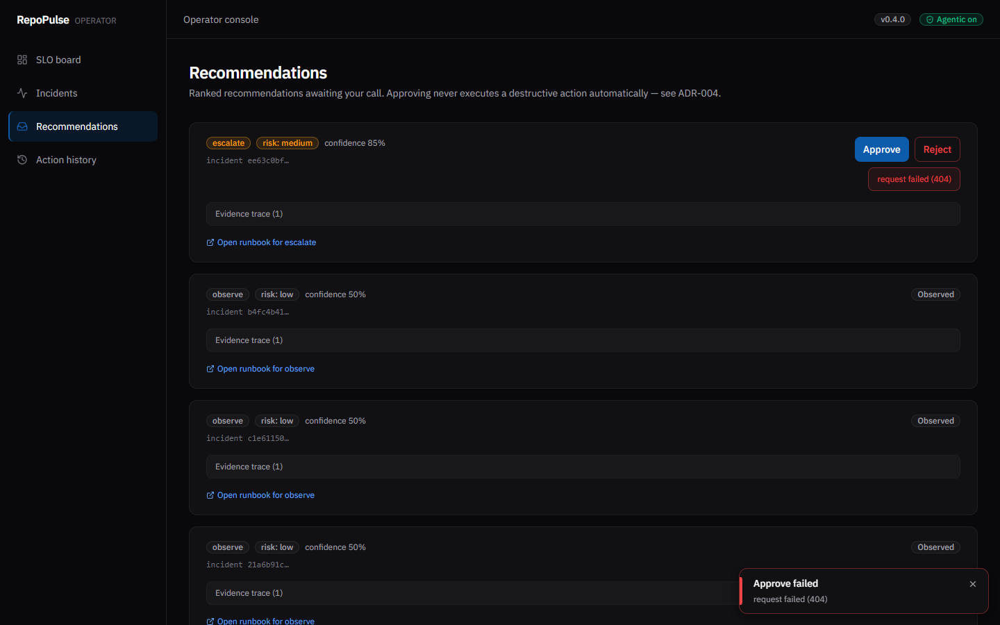

# Demo

## One command

```bash
./scripts/demo.sh
```

Boots:
- backend (`uvicorn :8000`)
- frontend (`next start :3000`)
- seeds the canonical dataset (95 push events + 5 error-log events + 1 critical
  github event + 1 workflow-run usage event)

…and prints the URLs. Ctrl-C to stop.

If you want different ports:

```bash
PORT_BACKEND=8011 PORT_FRONTEND=3300 ./scripts/demo.sh
```

## What you should see

| Page | Screenshot | Expected state |
|---|---|---|
| **SLO board** (`/`) |  | Availability ~95% (red, over budget), Throughput counter, "slow burn" badge |
| **Incidents** (`/incidents`) |  | One critical incident + correlated event clusters, newest-first |
| **Recommendations** (`/recommendations`) |  | One pending **escalate** (the critical event) + observed R1 fallbacks |
| **Action history** (`/actions`) |  | Auto-observe entries + workflow-run filter chip; approve/reject also recorded |
| Approve/reject toasts |  | Bottom-right Base UI toast with success/error tone |

## Architecture

See [architecture.md](architecture.md) for the system diagram and
[../architecture.md](../architecture.md) for the persistence/SLO context.

## Prereqs

See [../SETUP.md](../SETUP.md).
