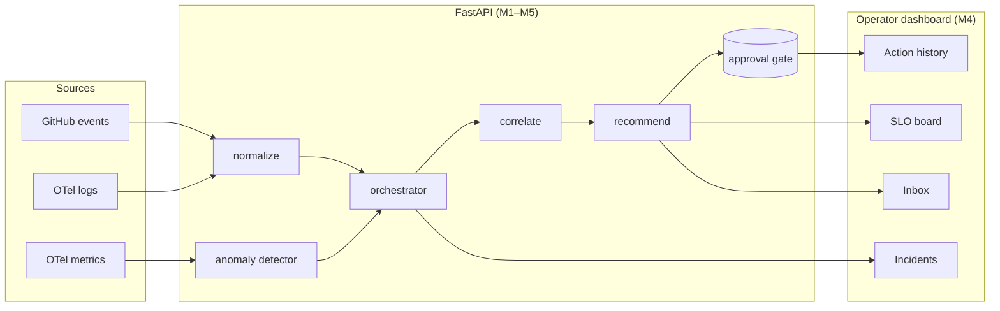

# Architecture

## Trust boundaries

The agentic GitHub workflows (M5) are the only path that can write to a
repository, and they do so under a least-privilege scoped `GITHUB_TOKEN`.
The backend never holds a GitHub credential. See
[ADR-003](../../adr/ADR-003-agentic-execution-model.md).

## Per-milestone diagrams

The full architecture diagram with persistence/SLO context lives in
[`docs/architecture.md`](../architecture.md). The M3 AIOps core flow is
in [`docs/aiops-core.md`](../aiops-core.md).
