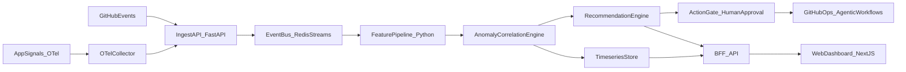

# RepoPulse AIOps - Detailed Implementation Plan (2026)

## Objective
Build a production-grade, portfolio-quality AIOps project that demonstrates:
- modern observability and reliability engineering
- AI-assisted operations with strict guardrails
- measurable engineering outcomes
- professional documentation and review workflow

This plan is designed for **Claude Code to execute milestone-by-milestone** while I review each milestone before continuation.

## Frontend Technology Mandates (Non-Optional)
Claude Code must follow these UI stack requirements:
- Use **Tailwind CSS** as the primary styling system.
- Use **shadcn/ui** for foundational UI primitives and composable components.
- Use **21st components** (via `@21st-dev/magic` integrations) for advanced/modern UI building blocks where appropriate.
- Keep accessibility at WCAG-friendly defaults (focus states, keyboard nav, contrast-safe themes).

## Design Skill CLI Requirement
Before building the main dashboard UI, Claude Code must use the **awesome-design-skills** workflow:

1. Review the registry and choose a style suitable for an AIOps dashboard (recommended starting points: `dashboard`, `professional`, `enterprise`, `shadcn`).
2. Pull the chosen skill into project tooling paths using:
   - `npx typeui.sh pull <slug>`
3. If needed, target providers explicitly:
   - `npx typeui.sh pull <slug> -p cursor,claude`
4. Record the selected skill and rationale in:
   - `docs/ui-design-system.md`
5. Apply the selected skill consistently across components and pages.

## Mandatory Agent Skill and Toolchain Preflight (Run Before Any Changes)
Before creating any project files, adding any function, or making any code/config change, Claude Code must complete this preflight:

1. Install and activate **Superpowers** workflow guidance:
   - Install/Docs: [https://github.com/obra/superpowers](https://github.com/obra/superpowers)
2. Install **Playwright CLI** for browser automation/testing workflows:
   - Install/Docs: [https://github.com/microsoft/playwright-cli](https://github.com/microsoft/playwright-cli)
3. Install and register **Obsidian Skills**:
   - Install/Docs: [https://github.com/kepano/obsidian-skills](https://github.com/kepano/obsidian-skills)
4. Prepare **Awesome Design Skills** CLI for the UI phase:
   - Install/Docs: [https://github.com/bergside/awesome-design-skills](https://github.com/bergside/awesome-design-skills)
5. Confirm in a preflight report (in `docs/preflight-checklist.md`) that these are available and ready.
6. For every milestone, explicitly state which relevant skills/workflows are being invoked before implementation.

If preflight is incomplete, implementation must not begin.

## Phase 0 Startup Sequence (Non-Negotiable, Strict Order)
Claude Code must execute this sequence exactly, in order:

1. **Install skills/tools** from official sources (links above).
2. **Invoke/verify skills/tools** (show proof they are callable/active).
3. **Only then read this implementation plan** and extract milestone scope.
4. **Only then start coding work** for the approved milestone.

If this order is violated, stop immediately and restart from Step 1.

## Official Install-Method Rule (No Guessed Commands)
To avoid hallucinations during setup:
- Do not guess install commands from memory.
- Read each official install page first.
- Use only documented commands from those pages.
- Record the exact commands and outputs in `docs/preflight-checklist.md`.
- If install docs are ambiguous or conflicting, stop and ask user before proceeding.

## Automatic Skill Invocation Policy (Strict)
Claude Code must automatically invoke relevant skills/workflows:
- before starting a new project area
- before creating or changing any function
- before any non-trivial refactor
- before any debugging cycle
- before claiming completion

This is mandatory process behavior, not optional guidance.

## Anti-Hallucination Protocol (Maximum Strictness)
Claude Code must follow these rules at all times. If any rule cannot be satisfied, it must stop and ask the user.

### 1) No-Assumption Rule
- Never invent file paths, APIs, commands, config keys, package names, or output values.
- Never claim a command succeeded unless command output is shown.
- Never claim a test passed unless test output is shown.
- Never claim a feature exists unless evidence is read from source files or official docs.

### 2) Evidence-First Rule
Every implementation or statement must be backed by at least one of:
- actual repository file content
- actual command output
- official upstream documentation link

For each milestone handoff, include an **Evidence Log** section:
- `Claim`
- `Evidence Source` (file path / command output / official URL)
- `Verification Method`

### 3) Zero-Fabrication Output Policy
Forbidden behaviors:
- fabricated stack traces
- fabricated benchmark numbers
- fabricated test coverage values
- fabricated screenshots/demos
- fabricated “done” status

If missing data exists, Claude Code must write: `UNKNOWN - NEEDS VERIFICATION`.

### 4) Verify-Before-Report Gate
Before any progress report or completion claim, Claude Code must run and record:
- lint/typecheck/test/build commands actually executed
- exit codes
- concise relevant output

No “looks good” or “should work” language without verification evidence.

### 5) Stop-on-Uncertainty Gate
Claude Code must immediately pause and ask the user when:
- requirements are ambiguous
- tool output conflicts with expected behavior
- docs and implementation disagree
- command fails twice without clear root cause
- security-sensitive action is uncertain

### 6) Source Priority Rule
When sources conflict, resolve using this precedence:
1. Current repository code
2. Official vendor/project docs
3. Community articles/posts

Do not treat community blog claims as authoritative when official docs disagree.

### 7) Deterministic Change Logging
For each PR-sized change, include:
- exact files changed
- exact reason for each change
- exact commands run
- exact outputs summary
- exact known limitations

### 8) Strict Completion Definition
A milestone is **not complete** unless all are true:
- acceptance criteria met
- verification commands passed
- evidence log included
- known risks explicitly listed
- no unresolved `UNKNOWN - NEEDS VERIFICATION` items

### 9) Hallucination Failure Rule
Any unverified claim or hallucinated detail is an automatic task failure.
Required response on failure:
1. Flag the exact claim as invalid.
2. Roll back to the last verified step.
3. Re-run verification with evidence.
4. Continue only after evidence is logged.

## UI Implementation Hold Gate (Must Stop and Ask First)
When reaching any substantial UI implementation (components, layout systems, page styling, design pass), Claude Code must:
1. Stop implementation.
2. Notify you that the UI phase is reached.
3. Wait for your confirmation that **awesome-design-skills** is installed and selected.
4. Resume UI work only after your explicit go-ahead.

No exceptions.

## Target Architecture

## Repository Layout to Produce
- `README.md`
- `docs/architecture.md`
- `docs/roadmap.md`
- `docs/security-model.md`
- `docs/slo-spec.md`
- `docs/runbooks/`
- `adr/` (`ADR-001`, `ADR-002`, ...)
- `backend/` (FastAPI services + workers + AIOps core)
- `frontend/` (Next.js dashboard)
- `infra/` (Docker Compose, OTel collector config, local stack)
- `.github/workflows/` (deterministic CI and optional agentic workflows)
- `examples/incident-scenarios/`

## Execution Rules for Claude Code
1. Execute **one milestone at a time**; do not jump ahead.
2. Keep changes PR-sized and logically grouped.
3. Update docs and ADRs in the same milestone as code changes.
4. Ensure deterministic CI checks pass before milestone handoff.
5. For risky automation, default to read-only or human approval.
6. Frontend work must use Tailwind CSS + shadcn/ui as baseline.
7. Use 21st components selectively for premium dashboard UX (without hurting performance).
8. Run the design-skill pull step before substantial UI implementation and document chosen skill.
9. Complete mandatory skill/tool preflight before any code changes.
10. Enforce the UI hold gate: stop and request user confirmation before UI buildout.

## Milestone Plan

### Milestone 1 - Foundation and Engineering Baseline
**Goal:** establish a professional skeleton and delivery pipeline.

**Build**
- Mandatory preflight completion (`superpowers`, `playwright-cli`, `obsidian-skills`) with report.
- Monorepo structure for `backend` and `frontend`.
- Backend starter with FastAPI app, health endpoint, settings model.
- Frontend starter with Next.js app and basic status page.
- Frontend stack setup with Tailwind CSS and shadcn/ui baseline.
- CI workflow: lint, type-check, test, build for both stacks.
- Base docs and `ADR-001` (hybrid architecture rationale).
- `docs/ui-design-system.md` initialized with design-skill selection notes.

**Deliverables**
- Bootable local dev environment.
- Green CI on first commit series.
- Documented setup steps in `README.md`.

**Acceptance Criteria**
- `docs/preflight-checklist.md` exists and verifies required installs/workflow readiness.
- `backend` and `frontend` both start locally.
- CI pipeline is reproducible and deterministic.
- Docs cover architecture, roadmap, and security assumptions.

---

### Milestone 2 - Observability + SLO Baseline
**Goal:** make telemetry trustworthy before adding heavy AI logic.

**Build**
- OpenTelemetry collector config in `infra/`.
- App instrumentation baseline (metrics/traces/log correlation).
- Initial SLI/SLO model and error budget definitions.
- Synthetic telemetry generator for demo scenarios.

**Deliverables**
- Telemetry flow from app -> collector -> storage/console path.
- `docs/slo-spec.md` with explicit formulas and thresholds.

**Acceptance Criteria**
- Service emits core RED metrics (rate, errors, duration).
- SLO burn-rate signal can be computed from sample data.
- Runbook for telemetry validation exists.

---

### Milestone 3 - AIOps Core (Detection + Correlation + Recommendations)
**Goal:** create the intelligence layer with explainable outputs.

**Build**
- Event ingestion and normalization pipeline.
- Anomaly detection module (robust baseline + seasonality-aware rules).
- Correlation module to group incident signals and infer likely causes.
- Recommendation engine that outputs:
  - action category
  - confidence
  - evidence trace
  - risk level

**Deliverables**
- End-to-end processing from input events to ranked recommendations.
- Test suite covering false positives/negatives for key paths.

**Acceptance Criteria**
- Every recommendation includes machine-readable evidence.
- Correlation groups related events into one incident timeline.
- Unit tests cover core decision functions.

---

### Milestone 4 - Operator Experience and Safety Controls
**Goal:** expose AIOps behavior through a professional UI and safe action flow.

**Build**
- Pause and request user confirmation before substantial UI implementation (hold gate).
- Dashboard pages: SLO board, incidents, recommendations, action history.
- Dashboard implementation using Tailwind CSS + shadcn/ui component patterns.
- Integrate 21st components where they improve clarity/interactions (cards, data visual emphasis, empty states, micro-interactions).
- Human approval gate for high-risk actions.
- Action policy matrix (allowed/blocked/review-required).
- Runbook links per recommendation type.

**Deliverables**
- Clear operator workflow from detection to approved action.
- Audit trail for recommendations and approvals.

**Acceptance Criteria**
- Risky actions cannot execute without explicit approval state.
- Dashboard refreshes incident/recommendation data correctly.
- UX clearly shows confidence, blast radius, and rationale.
- UI implementation is consistent with selected awesome-design-skills profile and documented in `docs/ui-design-system.md`.

---

### Milestone 5 - GitHub Agentic Workflows Integration
**Goal:** show 2026-ready GitHub-native AI automation with guardrails.

**Build**
- Agentic workflow definitions for:
  - issue triage/dedup suggestions
  - CI failure analysis summary
  - documentation drift checks
- Safe output constraints and scoped permissions.
- Cost/usage telemetry for workflow runs.

**Deliverables**
- Working GitHub automation examples with explicit boundaries.
- Docs describing security model and trust boundaries.

**Acceptance Criteria**
- Write operations are constrained and reviewable.
- Workflows are non-destructive by default.
- Clear fallback and disable mechanism documented.

---

### Milestone 6 - Portfolio Proof and Professional Finish
**Goal:** convert project quality into visible GitHub credibility.

**Build**
- Benchmark harness and reproducible incident demos.
- KPI report for reliability impact.
- Visual assets: screenshots, architecture diagram export, short demo flow.
- Final documentation polish and contributor guidance.

**Deliverables**
- `docs/results-report.md` with measured outcomes.
- Updated `README.md` with demo and architecture highlights.

**Acceptance Criteria**
- Project tells a clear story in under 3 minutes of repo browsing.
- KPIs are measurable and reproducible from provided scripts.
- Onboarding instructions are complete for reviewers/contributors.

## KPI Targets
- MTTR in simulations reduced by >=30%.
- False-positive alerts reduced by >=25%.
- SLO burn-rate detection lead time improved by >=20%.
- Incident scenario reproducibility >=90%.
- Core module coverage target >=80%.

## Review Loop (Must Follow)
After each milestone, Claude Code must return:
1. Files changed and why.
2. Commands run and outcomes.
3. Test results and known gaps.
4. Risk notes (security, reliability, maintainability).
5. Proposed next-milestone prompt.

I will review and either:
- approve and provide the next execution brief, or
- return a fix-focused delta plan.

## Immediate Start Prompt for Claude Code
Use this exact brief first:

> Execute Milestone 1 only. Start by completing mandatory preflight: ensure `superpowers`, `playwright-cli`, and `obsidian-skills` are installed/available and document verification in `docs/preflight-checklist.md`. Then initialize a hybrid monorepo with `backend` (FastAPI) and `frontend` (Next.js), deterministic CI, baseline docs (`README`, architecture, security model, roadmap), and `ADR-001`. Frontend baseline must include Tailwind CSS and shadcn/ui setup. Before substantial UI buildout, run awesome-design-skills CLI (`npx typeui.sh pull <slug>`) and document the selected skill in `docs/ui-design-system.md`. IMPORTANT: when reaching substantial UI work, stop and ask for explicit user confirmation before continuing. Prioritize production-grade structure, repeatable setup, and clean quality gates. Stop after Milestone 1 and report changed files, commands run, test results, known risks, and which skills/workflows were invoked.

